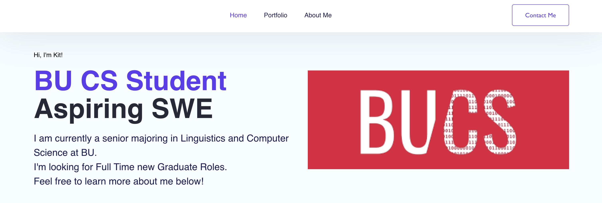

# Welcome to my Personal Web Portfolio!
## TECH STACK
React.Js
## Available Scripts

In the project directory, you can run:

### `sh setup.sh`
This shell script will install all the necessary dependencies and run the app

### Feel free to look around my website! 

### Link for deployment of my website
https://kits-web-portfolio1.netlify.app/
